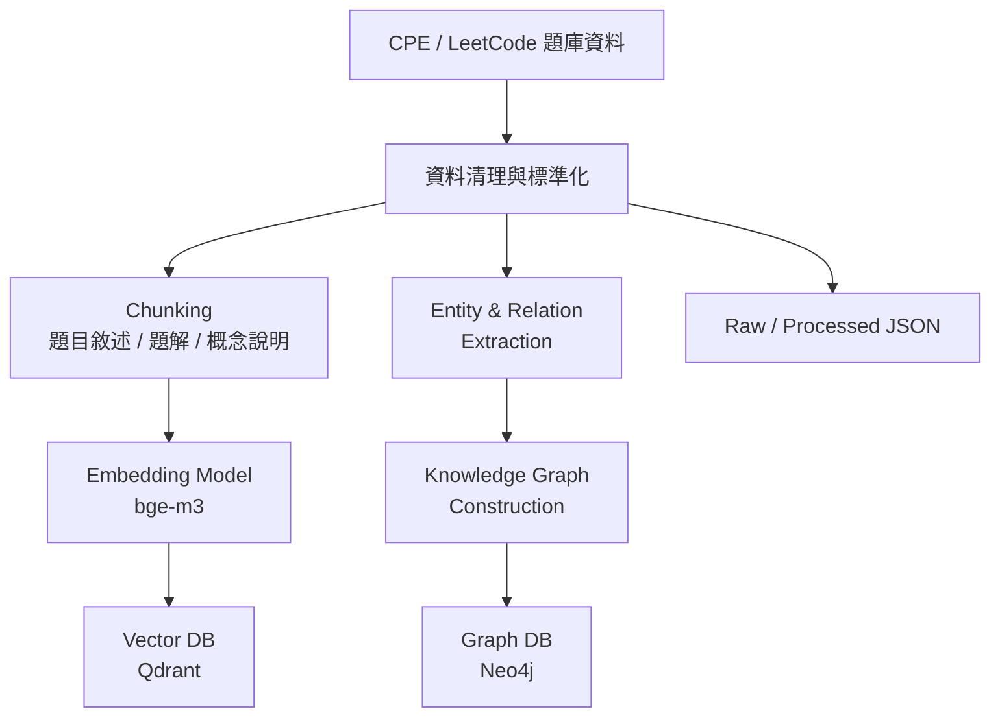
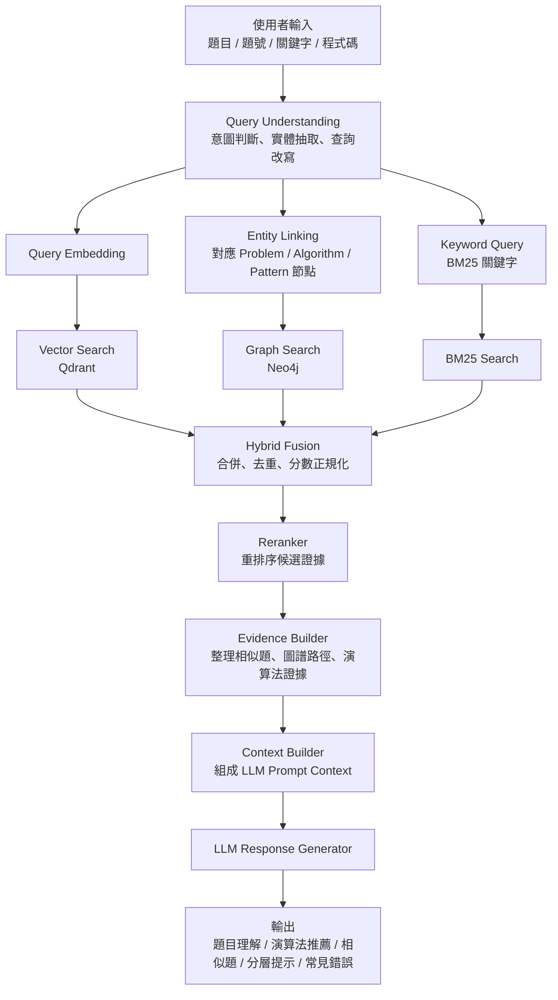

# Knowledge Graph + Hybrid RAG

這個專案把 CPE / LeetCode 題庫資料整理成可查詢的 Knowledge Graph + Hybrid RAG 系統。架構分成兩條主流程：

- 離線資料建庫流程：清理原始題目、建立 processed JSON、chunks、BM25 index、Qdrant vector records、Neo4j graph records。
- 線上查詢流程：理解使用者輸入，並行執行 BM25、Qdrant、Neo4j 三路檢索，再 fusion、rerank、整理 evidence/context，最後產生回答。

## 文件

- [架構說明](docs/architecture.md)
- [API contract](docs/api.md)
- [資料 contract](docs/data-contract.md)
- [Evaluation plan](docs/evaluation.md)
- [重構計畫](docs/Knowledge%20Graph%20+%20Hybrid%20RAG%20重構計畫.md)
- [Scripts](scripts/README.md)

## 資料建庫流程



CLI：

```powershell
python -m backend.app.ingestion build --input data/raw --processed data/processed --target all
```

Repo 內建 `data/raw/programming_problems.json` 作為 UTF-8 zh-Hant seed 資料，可直接用來產生本機 processed artifacts。

`--target` 可用：

```text
json
bm25
qdrant
neo4j
all
```

本機 demo 或測試不需要 Docker，可加上 fallback：

```powershell
python -m backend.app.ingestion build --input data/raw --processed data/processed --target all --allow-fallback
```

輸出 artifact：

```text
data/processed/problems.json
data/processed/chunks.json
data/processed/entities.json
data/processed/relations.json
data/processed/bm25_index.json
data/processed/qdrant_vectors.json
data/processed/neo4j_graph.json
data/processed/manifest.json
```

## 線上查詢流程



保留既有 endpoint：

```text
POST /api/analysis
POST /api/v1/analysis
POST /api/recommendations
POST /api/v1/recommendations
```

`POST /api/analysis` 保留既有 response 欄位，並新增可選 debug 欄位：

```text
retrievalTrace
evidenceBundle
contextPreview
```

`contextPreview` 只會在 `debug=true` 時回傳：

```powershell
curl.exe -X POST "http://localhost:8000/api/analysis?debug=true" `
  -H "Content-Type: application/json" `
  -d "{\"input\":\"unweighted graph shortest path BFS\"}"
```

### Store-backed retrieval scope

`OnlineQueryPipeline` can receive `vector_store`, `bm25_store`, and
`graph_store` instances for store-backed online retrieval. The search services
keep the local documents fallback when a store is not injected, so the default
API and quick-start demo still run without Docker or external services.

This round does not enable FastAPI runtime store mode. `POST /api/analysis`
still constructs the default local pipeline; wiring Qdrant, Neo4j, and
BM25Store into the running API is reserved for the next End-to-End Store-Backed
Demo phase. Query Understanding remains rule-based, and response generation
stays on the current mock-backed `LLMResponseGenerator`.

## 開發與驗證

```powershell
python -m ruff check .
python -m pytest tests/backend
cd frontend
npm.cmd run build
```

GitHub Actions 會在 PR 與 `main` push 時執行同等 backend lint/test 與 frontend build；backend CI 透過 `constraints-ci.txt` 固定主要 Python 依賴版本。

也可以用 quick start script 同時啟動 FastAPI 與 Vite：

```powershell
.\scripts\quick-start.ps1
```

## Docker Services

`docker-compose.yml` 提供正式 demo 用的資料庫：

```text
Neo4j:  http://localhost:7474 / bolt://localhost:7687
Qdrant: http://localhost:6333
```

測試環境不依賴 Docker，預設使用 deterministic mock provider 與 in-memory adapters。
