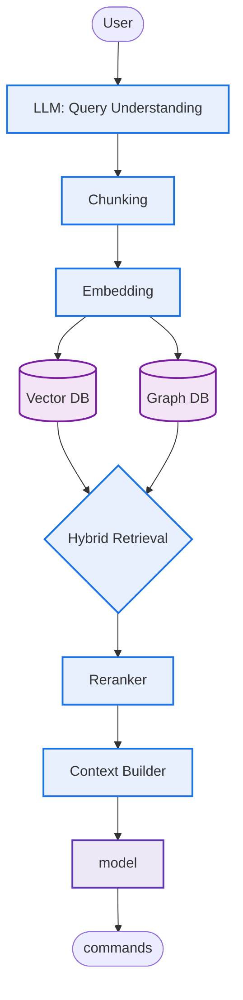

# knowledgegraph_rag
---
## System Architecture (1.0-MVP)

```mermaid
graph TD
    classDef process fill:#e8f0fe,stroke:#1a73e8,stroke-width:2px;
    classDef storage fill:#f3e5f5,stroke:#7b1fa2,stroke-width:2px;
    classDef model fill:#ede7f6,stroke:#5e35b1,stroke-width:2px;

    Input([User]) --> Query[LLM: Query Understanding]:::process
    Query --> Chunk[Chunking]:::process
    Chunk --> Embed[Embedding]:::process
    
    Embed --> VectorDB[(Vector DB)]:::storage
    Embed --> GraphDB[(Graph DB)]:::storage
    
    VectorDB --> Retrieval{Hybrid Retrieval}:::process
    GraphDB --> Retrieval
    
    Retrieval --> Rerank[Reranker]:::process
    Rerank --> Context[Context Builder]:::process
    
    Context --> LLM[model]:::model
    LLM --> Output([commands])
```