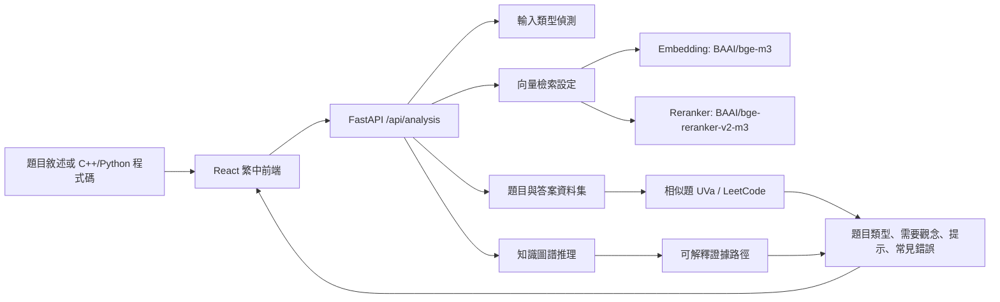

# Explainable Programming GraphRAG

This repository contains a v1 scaffold for an explainable programming-problem
assistant. It links problems, algorithms, data structures, and solution patterns
through a knowledge graph, then combines graph evidence with vector retrieval.

The first implementation intentionally does not fetch or bundle an online judge
dataset. Put user-provided CPE and LeetCode exports under `data/raw/` later and
adapt the ingestion pipeline without changing the retrieval contract.

## Goals

- Build a checkable knowledge graph for programming problem solving.
- Compare vector-only, graph-only, and hybrid retrieval.
- Surface evidence paths such as `Problem -> Concept -> Algorithm -> Pattern`.
- Keep LLM output constrained to retrieved evidence.
- Support OAuth-capable LLM providers through an adapter, without baking API
  keys into the core system.

## Structure Diagram



## Non-goals for v1

- No automatic full accepted-code generation.
- No dataset crawling or scraping.
- No account system, bookmarks, or learning history.
- No claim that GraphRAG is universally better than vector retrieval.

## Repository Layout

```text
backend/        FastAPI app, retrieval services, repositories, adapters
frontend/       React workbench for recommendations and evidence paths
data/raw/       Local dataset seed and later user-provided dataset files
data/processed/ Derived artifacts, not committed
docs/           Architecture and operating notes
tests/          Unit and integration tests
```

## Local Services

Neo4j and Qdrant are defined in `docker-compose.yml` for local development.
The in-memory repositories are used by tests and by the app when external
services are not configured.

```powershell
docker compose up -d neo4j qdrant
```

## Development Notes

Python tests are designed to cover the core retrieval behavior without needing
Neo4j, Qdrant, a dataset, or an LLM API key.

Quick start for the backend and frontend:

```powershell
.\scripts\quick-start.ps1
```

Check local prerequisites without starting services:

```powershell
.\scripts\quick-start.ps1 -Check
```

```powershell
python -m pytest tests/backend
```

Run the backend API:

```powershell
python -m uvicorn backend.app.main:app --reload --host 127.0.0.1 --port 8000
```

For the frontend, PowerShell may block `npm.ps1`; use `npm.cmd` instead.

```powershell
cd frontend
npm.cmd install
npm.cmd run dev
```

The Vite dev server proxies `/api/*` to `http://127.0.0.1:8000`, so the web app
can call FastAPI without changing frontend code.

## Current Demo Behavior

`/api/analysis` and `/api/v1/analysis` are the primary UI endpoints. They accept
either a problem statement or pasted C++/Python code and return:

- problem type
- required concepts
- similar UVa/LeetCode problems
- an explanation for why those problems are similar
- solving hints
- common mistakes
- graph evidence paths
- retrieval model configuration

`/api/recommendations` and `/api/v1/recommendations` use a small in-memory demo
graph until real CPE/LeetCode data is imported. The frontend still has a local
mock fallback so the workbench remains inspectable even when the API is not
running.

The local dataset seed lives at `data/raw/programming_problems.json` and can
store programming problems with answers and solution hints. The default retrieval
model configuration is:

- Embedding: `BAAI/bge-m3`
- Reranker: `BAAI/bge-reranker-v2-m3`
- Language: `zh-Hant`

When adding the real dataset later:

1. Put raw exports under `data/raw/`.
2. Convert them into the `docs/data-contract.md` records.
3. Load graph records into Neo4j and vector records into Qdrant.
4. Keep the same API response shape documented in `docs/api.md`.
