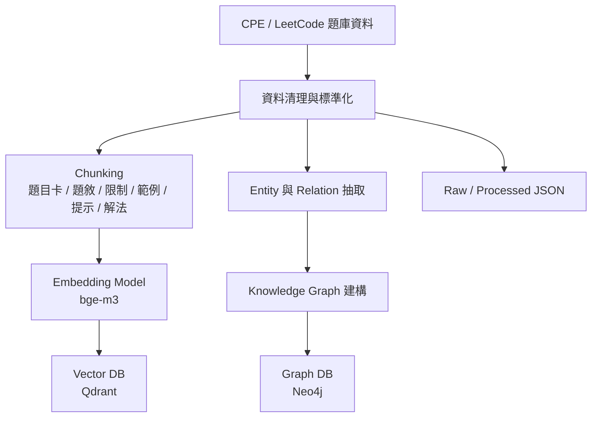
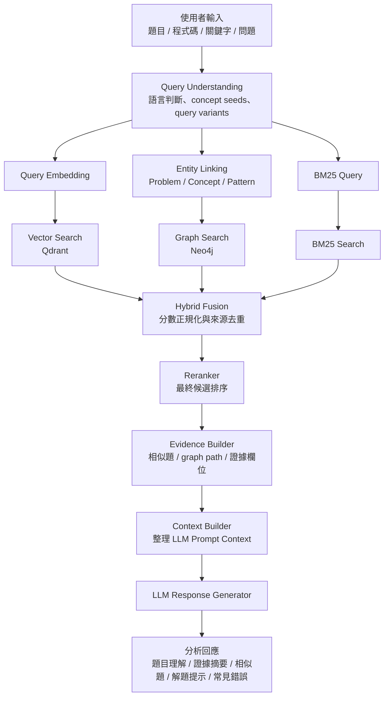

# Knowledge Graph + Hybrid RAG

這個專案把 CPE / LeetCode 題庫整理成可解釋的演算法檢索系統。核心分成兩條流程：

- 離線建庫：清理原始題目、用 structured chunking 產生題目卡 / 題敘 / 限制 / 範例 / 提示 / 解法等區塊，並輸出 `problems.json`、`chunks.json`、`bm25_index.json`、`qdrant_vectors.json`、`neo4j_graph.json`。
- 線上查詢：理解使用者輸入，並行執行 BM25、向量、圖譜三路檢索，再融合、重排、整理證據與回答。

## 文件導覽

- [架構說明](docs/architecture.md)
- [API contract](docs/api.md)
- [資料 contract](docs/data-contract.md)
- [驗證與評估](docs/evaluation.md)
- [Scripts](scripts/README.md)

## 離線建庫流程



建庫指令：

```powershell
python -m backend.app.ingestion build --input data/raw --processed data/processed --target all
```

Repo 內建 `data/raw/programming_problems.json`，內容維持 UTF-8 可讀的繁體中文，可直接產生本機 `processed` artifacts。

`--target` 可用值：

```text
json
bm25
qdrant
neo4j
all
```

本機測試如果不想依賴 Docker，可用 `--allow-fallback`：

```powershell
python -m backend.app.ingestion build --input data/raw --processed data/processed --target all --allow-fallback
```

輸出檔案：

```text
data/processed/problems.json
data/processed/chunks.json
data/processed/entities.json
data/processed/relations.json
data/processed/bm25_index.json
data/processed/qdrant_vectors.json
data/processed/neo4j_graph.json
data/processed/manifest.json
```

補充：

- `chunks.json` 的每筆 chunk 目前同時帶 `text` / `displayText`（顯示 lane）與 `searchText`（索引 lane）。
- runtime ingestion 目前只接 `StructuredProblemChunker`；`ProblemStatementChunker`、`GenericFallbackChunker`、`CodeChunker` 仍是 lab-only，只有單元測試覆蓋，沒有接進 `/api/analysis`。

## 多語查詢理解與雙語擴展

`backend/app/query_language.py` 會在正式檢索前先建立 `QueryLanguageProfile`，處理這個分支新增的多語查詢能力：

- 偵測 `zh-Hant`、`en`、`mixed`。
- 在 ASCII tokenization 前先擷取中文詞組，例如 `無權圖`、`最短步數`、`起點`、`終點`。
- 產生 `keywords`、`exactTerms`、`lowWeightTerms`、`conceptSeeds`、`expandedTerms`、`queryVariants`。
- 依規則推導概念，例如 `無權圖 + 最短步數 -> BFS + Shortest Path`，`BFS -> Queue + Visited Array`。

`queryVariants` 會分成三種用途：

- `bm25`：保留原始中文查詢，並附加英文 alias。
- `vector`：優先使用英文語意化改寫，否則退回擴展詞。
- `graphSeeds`：直接放 `concept:*` 或 `pattern:*` 實體 ID，讓 graph search 可以直接起跑。

例如查詢：

```text
給定一張無權圖與起點、終點，請找出從起點到終點的最短步數。
```

會穩定產生 `無權圖`、`最短步數` 等關鍵詞，並推導 `BFS`、`Queue`、`Shortest Path`、`Graph Traversal` 等概念種子。

## 線上查詢流程



三條檢索路徑在這個分支的行為如下：

- `BM25SearchService` 使用 `queryVariants["bm25"]`，而不是只吃 `normalizedQuery`。本地與 store 模式都只保留 `score > 0` 的候選。
- `VectorSearchService` 使用 `queryVariants["vector"]`，保留原始查詢於 trace 內。
- `EntityLinkingService` 會把 `graphSeeds` 直接轉成 linked entities，因此即使沒有 exact matched problem，graph search 也能靠概念種子找路徑。
- Evidence / response assembly 以 `EvidenceBuilder` 選出的 display / evidence scope 為準；exact 題號與 concept-only query 不會再從 raw reranked candidates 繼承無關的相似題、提示或常見錯誤。

## Runtime Retrieval Backend

FastAPI 支援兩種 retrieval backend：

```text
RETRIEVAL_BACKEND=local
RETRIEVAL_BACKEND=stores
```

- `local` 是預設值，使用本機 fallback documents，不需要 Docker。
- `stores` 會建立 `QdrantVectorStore`、`Neo4jGraphStore`、`JsonBM25Store`，並從 `PROCESSED_PROBLEMS_PATH` 載入 runtime documents。

`.env.example` 內對應的預設值：

```text
BM25_INDEX_PATH=data/processed/bm25_index.json
PROCESSED_PROBLEMS_PATH=data/processed/problems.json
```

啟動 `stores` 模式 demo：

```powershell
.\scripts\quick-start.ps1 -Stores
```

查 debug trace：

```powershell
curl.exe -X POST "http://localhost:8000/api/analysis?debug=true" `
  -H "Content-Type: application/json" `
  -d "{\"input\":\"給定一張無權圖與起點、終點，請找出從起點到終點的最短步數。\",\"mode\":\"hybrid\",\"topK\":3}"
```

在 `stores` 模式下，debug response 會額外帶出：

```text
retrievalBackend
retrievalTrace.candidateSources.vector = qdrant
retrievalTrace.candidateSources.graph = neo4j
retrievalTrace.candidateSources.bm25 = bm25_index
```

## 開發與驗證

```powershell
python -m ruff check .
python -m pytest tests/backend
cd frontend
npm.cmd run build
```

也可以用 quick start script 同時啟動 FastAPI 與 Vite：

```powershell
.\scripts\quick-start.ps1
```

GitHub Actions 會在 PR 與 `main` push 時執行同等級的 backend lint/test 與 frontend build。backend CI 透過 `constraints-ci.txt` 固定主要 Python 依賴版本。

## Docker 服務

`docker-compose.yml` 提供正式 demo 使用的外部服務：

```text
Neo4j:  http://localhost:7474 / bolt://localhost:7687
Qdrant: http://localhost:6333
```

測試環境不依賴 Docker，預設可用 deterministic mock provider 與 in-memory adapters 完成驗證。
