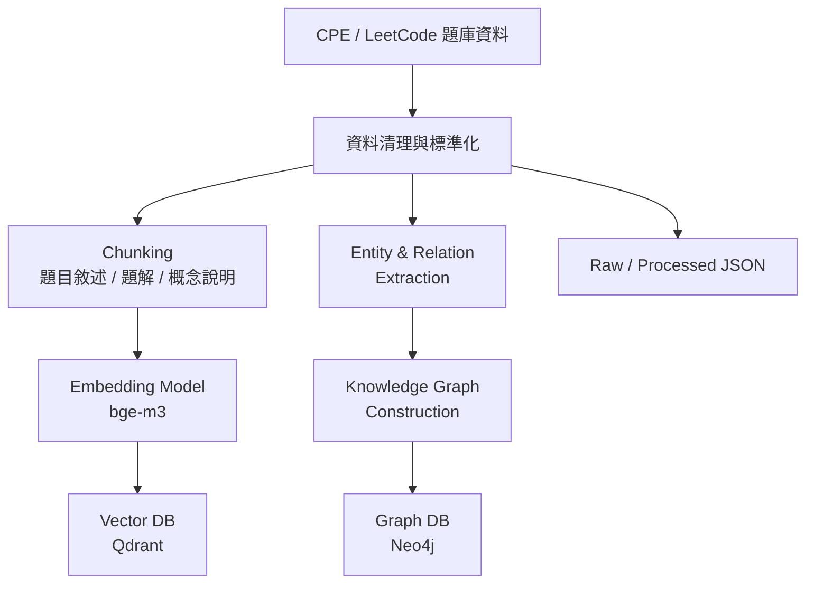
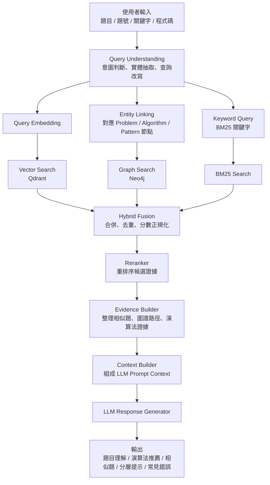

# Architecture

本專案的目標是把題庫資料做成可解釋的 Knowledge Graph + Hybrid RAG 系統。整體設計拆成兩條明確流程：

- Offline Indexing Pipeline：把 raw 題庫資料轉成 JSON、BM25、vector、graph artifacts。
- Online Query Pipeline：把使用者查詢送入三路檢索，再整理 evidence、context 與 LLM 回答。

## Offline Indexing Pipeline



實作位置：

- `backend/app/ingestion/`：ingestion CLI 與 artifact builder。
- `backend/app/contracts.py`：`RawProblem`、`ProblemChunk`、`EntityRecord`、`RelationRecord` 等資料 contract。
- `backend/app/providers.py`：`EmbeddingProvider` 與 `DeterministicMockEmbeddingProvider`。
- `backend/app/stores.py`：`VectorStore`、`GraphStore`、`BM25Store` 介面。
- `backend/app/adapters/`：in-memory、Qdrant、Neo4j adapter。

CLI：

```powershell
python -m backend.app.ingestion build --input data/raw --processed data/processed --target all
```

`--target` 可為 `json`、`bm25`、`qdrant`、`neo4j`、`all`。當 Qdrant 或 Neo4j 不可用時，正式 target 會清楚失敗；本機 demo 可加 `--allow-fallback` 只輸出本地 artifacts。

輸出：

```text
data/processed/problems.json
data/processed/chunks.json
data/processed/entities.json
data/processed/relations.json
data/processed/bm25_index.json
data/processed/qdrant_vectors.json
data/processed/neo4j_graph.json
data/processed/manifest.json
```

## Online Query Pipeline



`backend/app/retrieval/pipeline.py` 將線上流程拆成可單測服務：

- `QueryUnderstandingService`
- `EntityLinkingService`
- `VectorSearchService`
- `GraphSearchService`
- `BM25SearchService`
- `HybridFusionService`
- `Reranker`
- `EvidenceBuilder`
- `ContextBuilder`
- `LLMResponseGenerator`

Store-backed online retrieval is supported at the Python pipeline boundary.
`VectorSearchService`, `BM25SearchService`, and `GraphSearchService` accept
optional `VectorStore`, `BM25Store`, and `GraphStore` implementations. When a
store is injected, the service reads candidates from that store; when no store
is provided, the local document fallback remains active. `OnlineQueryPipeline`
forwards optional `vector_store`, `bm25_store`, and `graph_store` constructor
arguments into those services.

Graph store paths keep two shapes on purpose:

- `nodes` / `relations`: stable display summary, `input -> linked entity -> problem`.
- `storePath.nodes` / `storePath.relations`: raw nodes and relations returned by the store.

Query embedding 由 `OnlineQueryPipeline` 透過 `EmbeddingProvider` 執行，預設使用 deterministic mock provider，正式設定保留 `BAAI/bge-m3` 作為模型名稱。

API 層的 `POST /api/analysis` 與 `POST /api/v1/analysis` 保留既有 response 欄位，並新增：

- `retrievalTrace`
- `evidenceBundle`
- `contextPreview`

## Runtime Backend Selection

FastAPI reads `RETRIEVAL_BACKEND` at startup:

- `local`: builds the default `OnlineQueryPipeline()` and keeps the local fallback behavior.
- `stores`: builds `QdrantVectorStore`, `Neo4jGraphStore`, and `JsonBM25Store`, then injects them into `OnlineQueryPipeline`.

This is runtime wiring, not a full dataset source replacement.
`OnlineQueryPipeline` still uses the existing runtime documents as the graph
candidate set. Loading documents from `data/processed/problems.json` belongs in
a separate follow-up phase.

`JsonBM25Store` reads `data/processed/bm25_index.json` immediately. Qdrant and
Neo4j constructors do not intentionally run health checks here, so connection
failures may surface on the first query unless a future task adds explicit
health checks.

The API keeps the existing logical retrieval lanes: vector, graph, BM25,
fusion, and rerank. In debug mode, `retrievalTrace.candidateSources` identifies
the physical backend for each lane:

```json
{
  "vector": "qdrant",
  "graph": "neo4j",
  "bm25": "bm25_index"
}
```

Graph store paths keep two shapes:

- `nodes` / `relations`: stable display summary, `input -> linked entity -> problem`.
- `storePath.nodes` / `storePath.relations`: raw nodes and relations returned by Neo4j.

`contextPreview` 只在 `debug=true` 時回傳，避免正式 UI 每次暴露完整 prompt context。

## Provider / Adapter Boundary

Provider 介面：

```text
EmbeddingProvider
LLMProvider
```

Store 介面：

```text
VectorStore
GraphStore
BM25Store
```

Adapter 實作：

```text
InMemoryVectorStore
InMemoryGraphStore
InMemoryBM25Store
QdrantVectorStore
Neo4jGraphStore
```

測試預設使用 deterministic mock 與 in-memory adapters。正式 demo 可透過 Docker 啟動 Qdrant 與 Neo4j，再切換 adapter 對接真實服務。

## Frontend Trace View

Frontend 主要畫面對齊線上查詢流程：

```text
輸入 -> 查詢理解 -> 三路檢索 -> fusion/rerank -> evidence/context -> 回答
```

`frontend/src/App.tsx` 顯示 trace、候選、evidence bundle 與 debug context preview。`frontend/src/api.ts` 保留 mock fallback，後端不可用時仍能展示完整流程。
