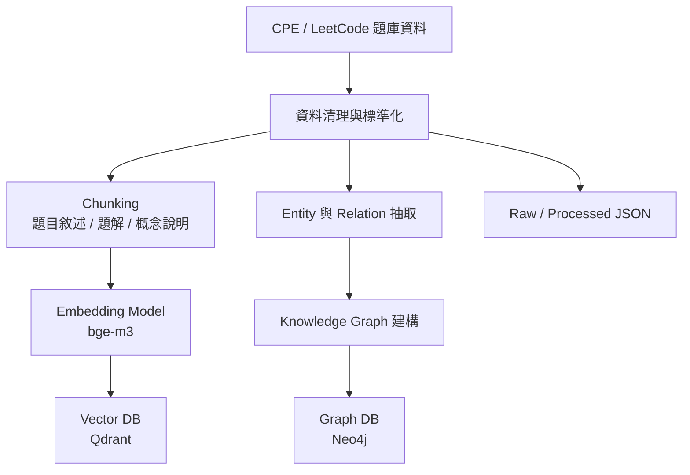
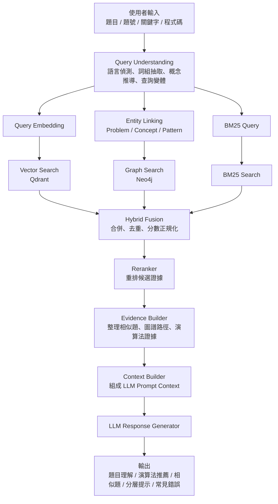

# 架構說明

本專案把題庫資料做成可解釋的演算法檢索系統。設計上分成兩段：

- 離線建庫流程：把原始題目轉成可供 BM25、向量、圖譜使用的 artifacts。
- 線上查詢流程：先理解查詢，再執行三路檢索、融合、重排，最後整理證據與回答。

## 離線建庫流程



主要實作位置：

- `backend/app/ingestion/`：ingestion CLI 與 artifact builder。
- `backend/app/contracts.py`：`RawProblem`、`ProblemChunk`、`EntityRecord`、`RelationRecord` 等資料契約。
- `backend/app/providers.py`：`EmbeddingProvider` 與 `DeterministicMockEmbeddingProvider`。
- `backend/app/stores.py`：`VectorStore`、`GraphStore`、`BM25Store` 介面。
- `backend/app/adapters/`：in-memory、Qdrant、Neo4j adapter。
- `backend/app/query_language.py`：多語 alias、概念推導、查詢變體建構。

在這個分支，離線流程多了一層雙語檢索文字建構：

- `_bm25_search_text()` 透過 `build_search_text()` 把 `problemId`、`source`、`sourceId`、`title`、`problemType`、`concepts`、雙語 alias、原始 chunk 文字組成 `searchText`。
- `bm25_index.json` 寫入的是這份 `searchText`，而不是只存原始 chunk。
- `qdrant_vectors.json` 的向量也是對 `searchText` 做 embedding，不是直接對 `chunk.text` 做 embedding。
- `payload` 仍保留乾淨的顯示文字與 chunk 欄位，不會把原始內容粗暴翻譯後覆蓋。

這樣做的目的很直接，中文查詢可以打中英文 alias，英文查詢也可以吃到中文概念，同時保留乾淨的顯示內容。

## 線上查詢流程



`backend/app/retrieval/pipeline.py` 仍然維持服務拆分，但 `QueryUnderstandingService` 與檢索服務的責任變得更清楚：

- `QueryUnderstandingService`：正規化查詢、判斷 `inputKind`、建立多語 `QueryLanguageProfile`。
- `EntityLinkingService`：優先連 `matchedProblem`、`codeFeatures`、`graphSeeds`，再補概念 alias 比對。
- `VectorSearchService`：使用 `queryVariants["vector"]` 做 embedding。
- `BM25SearchService`：使用 `queryVariants["bm25"]`，本地與 store 模式都只保留 `score > 0` 的候選。
- `GraphSearchService`：即使沒有 exact matched problem，也能直接使用 `graphSeeds` 找圖路徑。
- `HybridFusionService`、`Reranker`、`EvidenceBuilder`、`ContextBuilder`、`LLMResponseGenerator`：保持既有責任。

### 多語查詢理解規則

`backend/app/query_language.py` 現在是查詢理解的核心，主要規則如下：

- 語言偵測：輸入會標記成 `zh-Hant`、`en`、`mixed`。
- 詞組抽取：先抓中文詞組，再做 ASCII tokenization。
- 雙語 alias：例如 `無權圖 -> unweighted graph`、`廣搜 -> BFS`、`圖遍歷 -> Graph Traversal`。
- 概念推導：
  - `無權圖 + 最短步數 / 最短路徑 -> BFS + Shortest Path`
  - `BFS -> Queue + Visited Array`
  - `網格 / matrix + shortest path -> Graph Traversal + BFS`
  - `起點 + 終點 + 最短步數 -> Shortest Path + BFS`
- 查詢變體：
  - `bm25`：原始查詢加英文擴展詞
  - `vector`：英文語意化改寫，沒有則退回擴展詞
  - `graphSeeds`：`concept:*` / `pattern:*` ID

### Graph Path 形狀

圖譜路徑刻意保留兩個層次：

- `nodes` / `relations`：穩定的對外顯示形狀，通常是 `problem -> source -> target`。
- `storePath.nodes` / `storePath.relations`：保留 Neo4j 原始回傳內容，方便 debug。

每條 graph path 也會帶：

- `graphPathOperation`：`candidate_retrieval` 或 `exact_expansion`
- `pathScoring.strategy`：固定為 `weighted_layered_path_v1`
- `scoreMeta`：標示這是 graph path 分數，不可直接跟 BM25 / vector / reranker 分數混比

## Runtime Backend Selection

FastAPI 啟動時讀取 `RETRIEVAL_BACKEND`：

- `local`：建立預設 `OnlineQueryPipeline()`，走本機 fallback documents。
- `stores`：建立 `QdrantVectorStore`、`Neo4jGraphStore`、`JsonBM25Store`，並透過 `ProcessedProblemDocumentLoader` 從 `PROCESSED_PROBLEMS_PATH` 載入 runtime documents。

在 `stores` 模式下：

- `BM25_INDEX_PATH` 預設為 `data/processed/bm25_index.json`
- `PROCESSED_PROBLEMS_PATH` 預設為 `data/processed/problems.json`
- `retrievalTrace.candidateSources` 會在 debug mode 顯示每一條邏輯檢索路徑對應到哪個實體 backend

```json
{
  "vector": "qdrant",
  "graph": "neo4j",
  "bm25": "bm25_index"
}
```

## Provider 與 Adapter 邊界

Provider 介面：

```text
EmbeddingProvider
LLMProvider
```

Store 介面：

```text
VectorStore
GraphStore
BM25Store
```

Adapter 實作：

```text
InMemoryVectorStore
InMemoryGraphStore
InMemoryBM25Store
QdrantVectorStore
Neo4jGraphStore
```

測試預設使用 deterministic mock provider 與 in-memory adapters。正式 demo 可透過 Docker 啟動 Qdrant 與 Neo4j，再把 store adapter 切到真實服務。

## 前端追蹤面板

前端畫面對齊線上查詢流程：

```text
輸入 -> 查詢理解 -> 三路檢索 -> fusion/rerank -> evidence/context -> 回答
```

`frontend/src/App.tsx` 目前會顯示：

- `queryLanguage`
- `exactTerms`
- `lowWeightTerms`
- `conceptSeeds`
- `expandedTerms`
- `queryVariants.bm25`
- `queryVariants.vector`
- `queryVariants.graphSeeds`

`frontend/src/api.ts` 會正規化這些欄位，並在後端不可用時丟出明確錯誤，不會偽造一個看起來成功的 API 回應。
