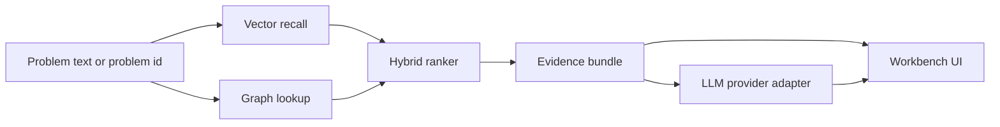

# Architecture

## Scope

The v1 system is an evaluation-oriented GraphRAG workbench. It helps inspect why
a problem is associated with specific algorithms, data structures, and solution
patterns. It does not attempt to solve every problem end-to-end or generate full
accepted code.

## Core Flow

## Knowledge Graph

Primary node types:

- `Problem`
- `Concept`
- `Algorithm`
- `DataStructure`
- `Pattern`
- `Complexity`

Primary relation types:

- `REQUIRES`
- `SOLVED_BY`
- `USES`
- `HAS_PATTERN`
- `HAS_COMPLEXITY`
- `SIMILAR_TO`
- `EXCLUDES`

The `EXCLUDES` relation is important for explainability. It lets the system say
why a tempting algorithm is not recommended, for example when negative weights
exclude Dijkstra-style reasoning.

## Retrieval Modes

- Vector-only: semantic recall from problem statement and metadata.
- Graph-only: graph traversal from known concepts or problem ids.
- Hybrid: combines vector score, graph path support, and concept overlap.

The hybrid claim is deliberately narrow: v1 measures whether hybrid retrieval
improves ambiguous, cross-concept, and exclusion-heavy cases in a frozen test
set. It should not claim universal superiority.

Default model configuration for Traditional Chinese retrieval:

- Embedding: `BAAI/bge-m3`
- Reranker: `BAAI/bge-reranker-v2-m3`
- Language: `zh-Hant`

The scaffold exposes these names as configuration only. It does not download or
execute model weights during tests or local quick start.

## Dataset Seed

`data/raw/programming_problems.json` is a deterministic local seed for problem
statements, answers, solution hints, concepts, and source metadata. It is small
by design so the analysis endpoint can demonstrate graph traversal explanations
without crawling UVa, LeetCode, or CPE.

## LLM Boundary

The LLM layer receives an evidence bundle and turns it into readable guidance.
It must not invent algorithms, paths, or constraints that are absent from the
bundle. OAuth-capable providers can be added behind `LLMProvider`, while tests
and evaluation can use a mock provider or no LLM at all.
