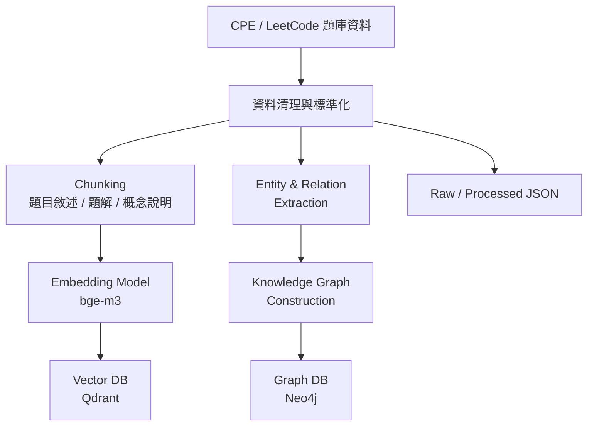
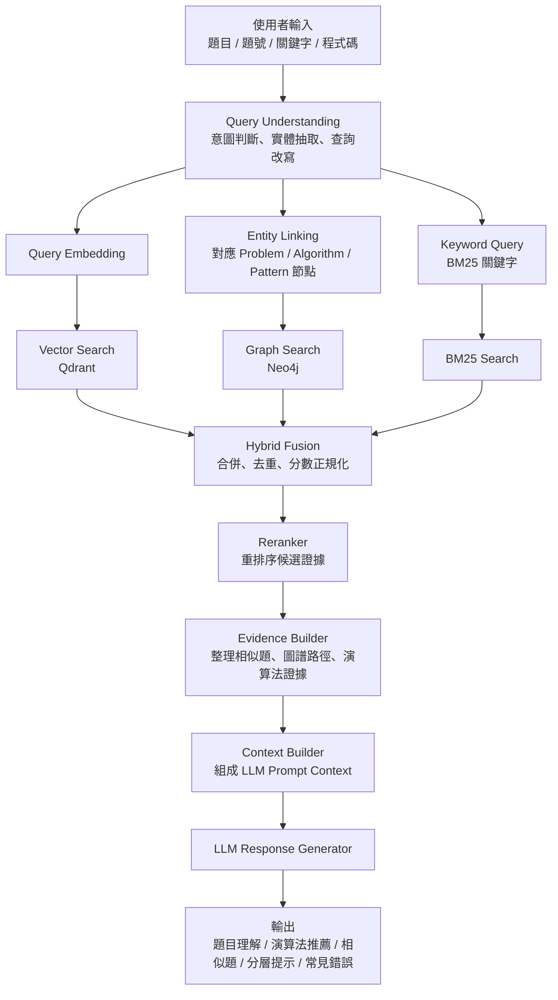

# Architecture

本專案已重構為 Knowledge Graph + Hybrid RAG 架構，分成離線建庫與線上查詢兩條流程。

## Offline Indexing Pipeline



目前 implementation：

- `backend/app/ingestion/` 提供 CLI 與 artifact builder。
- `RawProblem`、`ProblemChunk`、`EntityRecord`、`RelationRecord` 定義在 `backend/app/contracts.py`。
- `DeterministicMockEmbeddingProvider` 預設產生穩定向量，正式設定仍標示 `BAAI/bge-m3`。
- `QdrantVectorStore`、`Neo4jGraphStore` 已提供 Docker adapter；測試使用 in-memory / fake client。
- `--allow-fallback` 會只寫本機 JSON artifacts，不要求 Docker。

主要輸出：

```text
data/processed/problems.json
data/processed/chunks.json
data/processed/entities.json
data/processed/relations.json
data/processed/bm25_index.json
data/processed/qdrant_vectors.json
data/processed/neo4j_graph.json
data/processed/manifest.json
```

## Online Query Pipeline



目前 implementation：

- `backend/app/retrieval/pipeline.py` 拆出可單測服務：
  - `QueryUnderstandingService`
  - `EntityLinkingService`
  - `VectorSearchService`
  - `GraphSearchService`
  - `BM25SearchService`
  - `HybridFusionService`
  - `Reranker`
  - `EvidenceBuilder`
  - `ContextBuilder`
  - `LLMResponseGenerator`
- `POST /api/analysis` 已接上 `retrievalTrace`、`evidenceBundle` 與 debug-only `contextPreview`。
- 舊的 `HybridRetrievalService` 保留，避免破壞既有 recommendations tests。

## Provider / Adapter Boundary

Provider interfaces：

```text
EmbeddingProvider
LLMProvider
```

Store interfaces：

```text
VectorStore
GraphStore
BM25Store
```

Adapter implementations：

```text
InMemoryVectorStore
InMemoryGraphStore
InMemoryBM25Store
QdrantVectorStore
Neo4jGraphStore
```

正式服務可接 Docker Qdrant / Neo4j；測試與本機 demo 可用 mock / in-memory，避免環境耦合。
