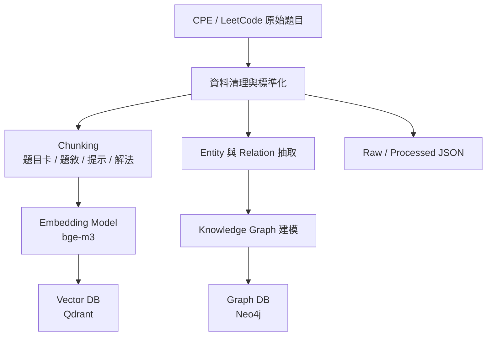
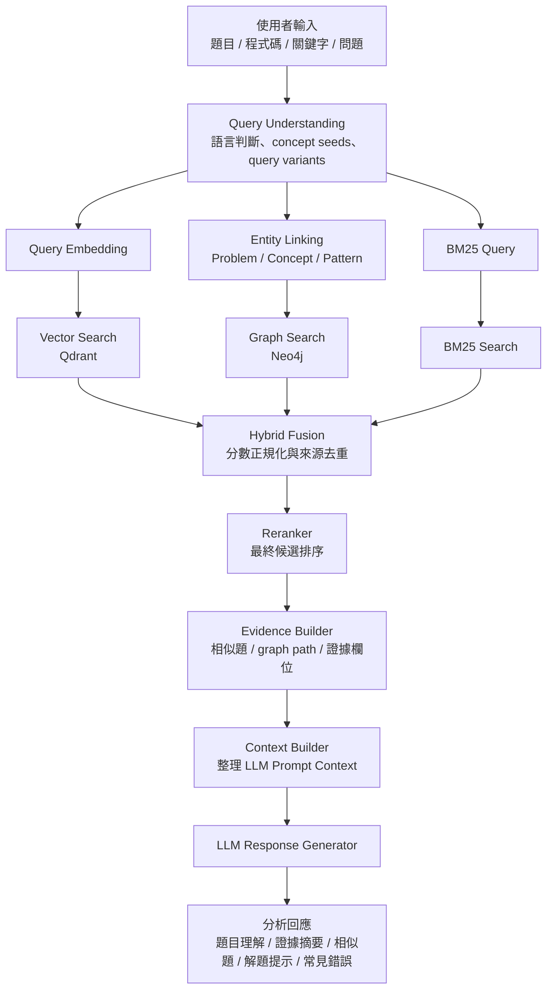

# 系統架構

本專案是一個以程式題檢索為主的 GraphRAG 原型：離線 ingestion 先整理題目資料與檢索 artifacts，線上 retrieval 再把 lexical、vector、graph 三條訊號融合，最後輸出分析結果。

- 離線 ingestion 會產生可供 BM25、Qdrant、Neo4j 與 runtime 載入的 artifacts。
- 線上 retrieval 會保留查詢理解、候選來源、graph path、evidence bundle 與 context preview 等可除錯資訊。

## 離線 ingestion 架構



主要模組：

- `backend/app/ingestion/`：ingestion CLI 與 artifact builder。
- `backend/app/contracts.py`：`RawProblem`、`ProblemChunk`、`EntityRecord`、`RelationRecord` 等資料契約。
- `backend/app/providers.py`：`EmbeddingProvider` 與 `DeterministicMockEmbeddingProvider`。
- `backend/app/stores.py`：`VectorStore`、`GraphStore`、`BM25Store` 介面。
- `backend/app/adapters/`：in-memory、Qdrant、Neo4j adapter。
- `backend/app/query_language.py`：雙語 alias、query expansion 與 search-text 組裝規則。
- `backend/app/chunking/router.py`：runtime chunking entry，目前只註冊 `structured_problem`。

### Chunk lane split

- `StructuredProblemChunker` 先產生乾淨的 `displayText`，這是 display/context lane。
- `StructuredProblemChunker` 目前會輸出 `problem_card`、`statement`、`constraints`、`examples`、`hints`、`solution`；template-only `commonMistakes` 不會變成 runtime chunk。
- `build_chunk_search_text()` 與 `build_search_text()` 會基於題目 metadata、concept alias 與 `displayText` 組出 bilingual `searchText`，這是 index-only lane。
- `text` 在 rollout 期間維持等於 `displayText`，避免既有依賴被破壞。
- template-derived `commonMistakes` 不得進入 `searchText`；若來源是 template，就不能把這些內容拿去建立索引文字。

### Lab-only chunkers

- `backend/app/chunking/problem_statement.py`、`fallback.py`、`code.py`、`optional_parser.py` 是實驗中的 lab-only chunkers。
- 這些 chunkers 目前只有單元測試覆蓋，沒有接進 `backend/app/ingestion/pipeline.py`、`backend/app/retrieval/pipeline.py` 或 `/api/analysis` runtime。

### Index artifacts

- `bm25_index.json.documents[*].text` 必須等於對應 chunk 的 `searchText`，而不是臨時從 `chunk.text` 重組。
- `qdrant_vectors.json` 的向量必須由 `searchText` 產生，不是直接對 `displayText` / `chunk.text` 做 embedding。
- chunk payload 仍保留乾淨的 `text` / `displayText` 與其他 evidence 欄位，不會把 alias expansion 或 template common mistakes 回寫到顯示 lane。

這樣做的目的很直接：中文查詢可以打中英文 alias，英文查詢也可以吃到中文概念，同時保留乾淨的顯示內容。

## 線上 retrieval 架構



`backend/app/retrieval/pipeline.py` 的責任分工如下：

- `QueryUnderstandingService`：判斷 `inputKind`，並建立 `QueryLanguageProfile`。
- `EntityLinkingService`：整合 `matchedProblem`、`codeFeatures`、`graphSeeds` 與 alias 規則。
- `VectorSearchService`：使用 `queryVariants["vector"]` 做 embedding 查詢。
- `BM25SearchService`：使用 `queryVariants["bm25"]`；本地與 store 模式都只保留 `score > 0` 的候選。
- `GraphSearchService`：沿用 `graphSeeds` 與 exact matched problem 的 graph expansion 規則。
- `HybridFusionService`、`Reranker`、`EvidenceBuilder`、`ContextBuilder`、`LLMResponseGenerator`：負責融合、重排、證據整理與最終輸出。

### ContextBuilder guardrail

- `ContextBuilder` 只能消費 evidence lane 與 display/context lane 的欄位，例如 `answerHint`、`solutionHints`、`difficulty`、`constraints`、`graphPaths` 與其他乾淨顯示文字。
- `ContextBuilder` 不得直接讀取任何 chunk `searchText`。
- `searchText` 中的 alias expansion、query expansion noise、索引輔助詞，都不應出現在 `contextPreview` 或最終顯示內容。

### 多語查詢理解規則

`backend/app/query_language.py` 是雙語檢索與 query expansion 的權威來源：

- 語言分類會標示 `zh-Hant`、`en`、`mixed`。
- `keywords` 會保留中文詞組，不只做 ASCII tokenization。
- 常見 alias 例如 `無權圖 -> unweighted graph`、`廣搜 -> BFS`、`圖遍歷 -> Graph Traversal`。
- `queryVariants` 包含：
  - `bm25`：原始查詢加英文 alias 與擴展詞。
  - `vector`：語意較平滑的查詢變體。
  - `graphSeeds`：`concept:*` / `pattern:*` entity IDs。

### Graph Path 形狀

graph path 需要同時保留穩定 public shape 與底層 store path：

- `nodes` / `relations`：穩定的 public shape，預設為 `problem -> source -> target`。
- `storePath.nodes` / `storePath.relations`：保留 Neo4j 原始路徑，方便 debug。
- `graphPathOperation`：`candidate_retrieval` 或 `exact_expansion`。
- `pathScoring.strategy`：目前固定 `weighted_layered_path_v1`。
- `scoreMeta`：明確標記 graph path 分數不可直接與 BM25 / vector / reranker 分數混比。

### Graph path runtime contract

`GraphSearchResult.paths` 是 graph store 或 in-memory graph search 回傳的 raw path 集合。pipeline 會在 reranking 與 evidence selection 後裁切成 `OnlineQueryResult.graph_paths`，也就是 API 看到的 pruned graph paths 與 `evidenceBundle.graphPaths`。

debug 模式可以在 `retrievalTrace.rawGraphPaths` 檢查尚未裁切的 raw paths；一般 UI、`contextPreview` 與 LLM prompt context 不應讀取 raw paths。candidate 的 `rawChunks` 與 `storePayload` 只供 provenance/debug 使用，不能取代 selected evidence。

`ContextBuilder` 只消費 display/context lane 與 selected evidence。matched evidence 由 `problemCard`、statement、solution、hints 組成；similar evidence 由 `problemCard` 與 `matchedChunk` 組成。`ContextBuilder` 不得讀取 `searchText`，也不得把 alias expansion 或 template-derived `common mistakes` 寫入 prompt context。

## Runtime Backend Selection

FastAPI 會根據 `RETRIEVAL_BACKEND` 選擇 backend：

- `local`：使用 `OnlineQueryPipeline()` 與 fallback documents。
- `stores`：使用 `QdrantVectorStore`、`Neo4jGraphStore`、`JsonBM25Store`，並透過 `ProcessedProblemDocumentLoader` 從 `PROCESSED_PROBLEMS_PATH` 載入 runtime documents。

`stores` 模式的主要設定：

- `BM25_INDEX_PATH` 預設為 `data/processed/bm25_index.json`
- `PROCESSED_PROBLEMS_PATH` 預設為 `data/processed/problems.json`
- `retrievalTrace.candidateSources` 會在 debug mode 中標示每個候選實際來自哪個 backend

```json
{
  "vector": "qdrant",
  "graph": "neo4j",
  "bm25": "bm25_index"
}
```

## Provider 與 Adapter 分層

Provider 介面：

```text
EmbeddingProvider
LLMProvider
```

Store 介面：

```text
VectorStore
GraphStore
BM25Store
```

Adapter 實作：

```text
InMemoryVectorStore
InMemoryGraphStore
InMemoryBM25Store
QdrantVectorStore
Neo4jGraphStore
```

測試預設使用 deterministic mock provider 與 in-memory adapters。正式 demo 可透過 Docker 啟動 Qdrant 與 Neo4j，再把 store adapter 切到真實服務。

## 前端與回應整合

前端主要依賴這些 retrieval 輸出：

```text
查詢理解 -> 檢索候選 -> 融合與重排 -> evidence/context -> 分析回應
```

`frontend/src/App.tsx` 會使用：

- `queryLanguage`
- `exactTerms`
- `lowWeightTerms`
- `conceptSeeds`
- `expandedTerms`
- `queryVariants.bm25`
- `queryVariants.vector`
- `queryVariants.graphSeeds`

`frontend/src/api.ts` 會處理分析回應欄位，並把可顯示的乾淨 evidence 呈現給使用者；索引用 `searchText` 不應直接穿透到 UI。
